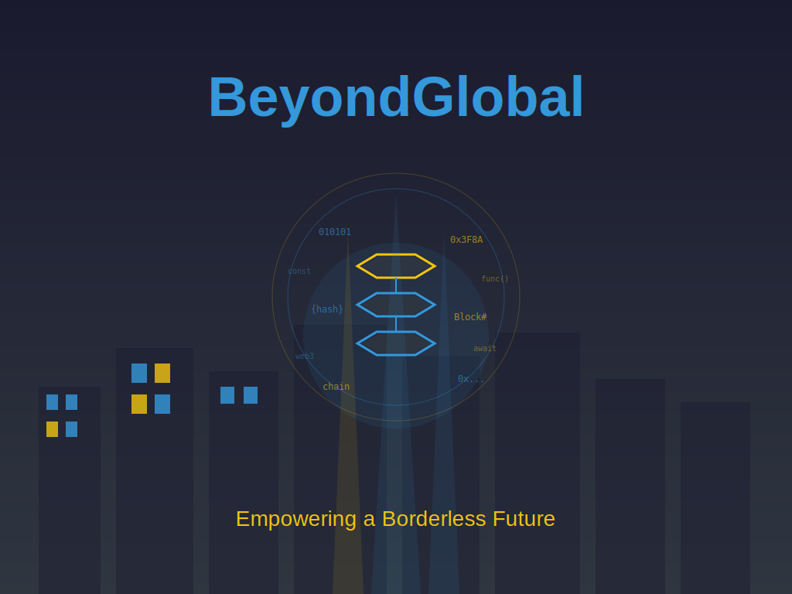

# BeyondGlobal Image

## Overview

The BeyondGlobal image represents a futuristic vision of blockchain technology in a cyberpunk-inspired aesthetic. This image is prominently featured in the frontend of the Big World Bigger Ideas platform.

## Description

A futuristic, neon-lit, cyberpunk cityscape with a massive, glowing blockchain structure at the center, surrounded by a halo of code, with the words 'BeyondGlobal' etched across the top in bold, futuristic letters, and the tagline 'Empowering a Borderless Future' written below in smaller text.

## Image Specifications

### Dimensions
- **Width:** 1024px
- **Height:** 768px
- **Format:** SVG (Scalable Vector Graphics)

### Color Scheme
- **Primary Color:** #3498db (Neon Blue)
- **Secondary Color:** #f1c40f (Neon Orange)
- **Background Color:** #2f3640 (Dark Gray)

## Files

### BeyondGlobal.svg
The main image file in SVG format, providing scalability without loss of quality.

### BeyondGlobal.html
An HTML document that displays the BeyondGlobal image with full specifications. This can be:
- Viewed directly in a web browser
- Converted to PDF using browser print functionality (Print to PDF)
- Shared as a standalone documentation page

## Usage

### In index.html
The BeyondGlobal image is displayed in the header section of the main documentation page:

```html
<div class="beyond-global-image">
    
</div>
```

### Viewing the Image
- **Main site:** The image appears at the top of [index.html](./index.html)
- **Full view:** Open [BeyondGlobal.html](./BeyondGlobal.html) for a detailed view with specifications
- **Direct file:** View [BeyondGlobal.svg](./BeyondGlobal.svg) directly

### Creating a PDF
To create a PDF version of the BeyondGlobal documentation:
1. Open `BeyondGlobal.html` in a web browser
2. Use the browser's Print function (Ctrl+P or Cmd+P)
3. Select "Print to PDF" as the destination
4. Save as `BeyondGlobal.pdf`

## Design Elements

### Cityscape
- Silhouetted buildings creating a futuristic skyline
- Neon-lit windows in blue and orange tones
- Varying building heights for depth and perspective

### Blockchain Structure
- Central hexagonal blockchain blocks
- Glowing connections between blocks
- Neon blue and orange color scheme representing different transaction types

### Code Halo
- Hexadecimal addresses (0x...)
- Binary code (010101)
- Blockchain terminology (hash, Block#, chain)
- Programming keywords (const, func(), web3, await)
- Creates a technical atmosphere around the central structure

### Typography
- **Title:** "BeyondGlobal" in large, bold, futuristic style
- **Tagline:** "Empowering a Borderless Future"
- Both with neon glow effects for cyberpunk aesthetic

## Integration with Frontend

The color scheme from BeyondGlobal has been integrated throughout the frontend:

### Header
- Background: #2f3640 (Dark Gray) with transparency
- Title color: #3498db (Neon Blue)
- Tagline color: #f1c40f (Neon Orange)
- Border: #3498db with transparency

### Main Content
- H2 borders: #3498db (Neon Blue)
- Network cards: Left border in #3498db
- Links and buttons: #3498db background

### Footer
- Background: #2f3640 (Dark Gray) with transparency
- Border: #3498db with transparency

## License

© 2024-2026 Matthew Brace (kushmanmb) | All Rights Reserved

Part of the Big World Bigger Ideas blockchain documentation platform.
